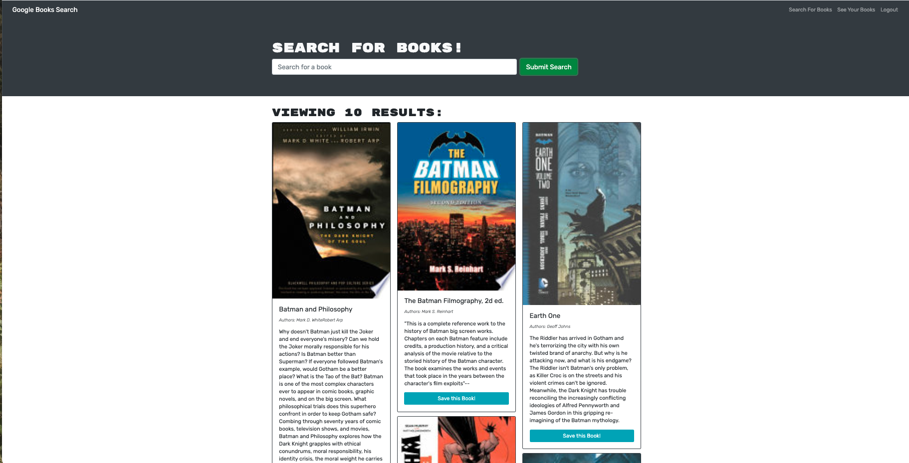
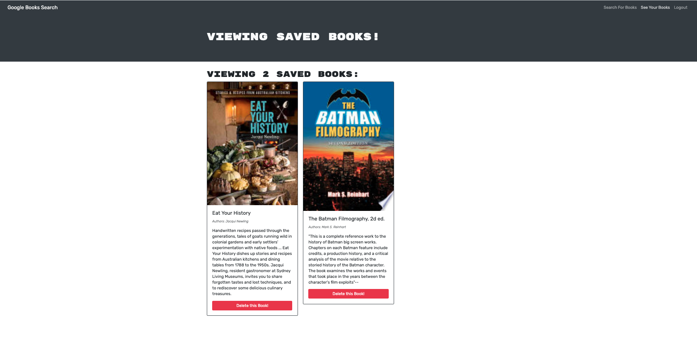

# MERN: Book Search Engine

## What?

Converted a RESTful API, into a GraphQL API built with Apollo Server.

## Links
### Link to deployed app is [here](https://hidden-wave-55120.herokuapp.com/)
### Link to its GitHub repo lives [here](https://github.com/michellewatts20000/book-search-engine)

## Technologies used
MERN stack with a React front end, MongoDB database, and Node.js/Express.js server and API.

## Screenshots of app

## Contact
Michelle Watts
watts.e.michelle@gmail.com